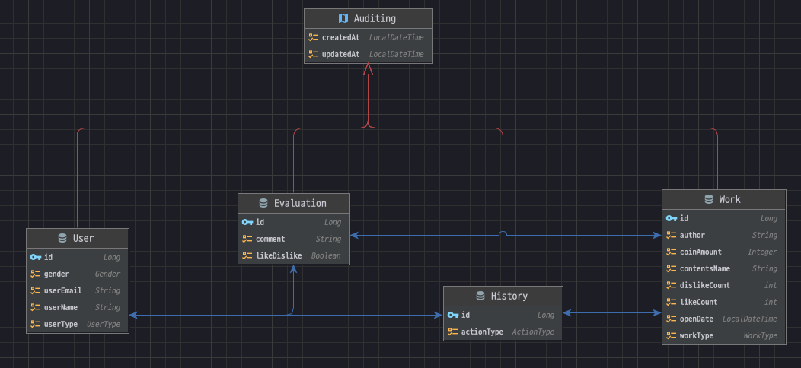

- 구성
  - 간단한 소스구성도
  - 테이블 안내
  - api 테스트 방법 (api 스팩)
  - 기타
- 구성
  - 스프링부트 3.0.5 버전, 코틀린 으로 진행하였습니다.
  - jpa 와 필요에 따라 queryDsl 을 사용하였습니다.
  - h2 in-memory 를 사용하였습니다.
  - 최대한 실무에 가깝게 작업하였습니다.
- erd 및 테이블 정보
  - 
  - 각테이블과 필드에는 Description 으로 정리를 하였습니다.
    - works: 작품 정보
    - history: 작품 이력 정보
    - users: 사용자 정보
    - works: 작품 정보
  - 설명:
    - 한 명의 사용자가 여러 평가(1:N 관계)를 가질 수 있습니다.
    - 한 명의 사용자가 여러 이력(1:N 관계)을 가질 수 있습니다.
    - 하나의 작품에 대해 여러 평가(1:N 관계)가 있을 수 있습니다.
    - 하나의 작품이 여러 이력(1:N 관계)을 가질 수 있습니다.
    - 각 평가는 하나의 사용자(N:1 관계)와 하나의 작업(N:1 관계)에 속합니다.
    - 각 이력은 하나의 사용자(N:1 관계)와 하나의 작업(N:1 관계)에 속합니다.
- api 테스트 방법 및 api 스팩: 기능 요청 목록 별로 나열 합니다.
  - 수행방법: 
    - 1.해당 소스에 있는 곳에 접속 후 "./gradlew build" 
    - 2.빌드가 완료되면 해당 폴더로 이동합니다 "cd build/libs"
    - 3."java -jar injin_lezhin-0.0.1-SNAPSHOT.jar" 명령어로 서버를 구동시켜줍니다.
    - 4.정상적으로 서버가 띄워지면 새로운 터미널 환경을 구동시켜 아래 api 스팩에 나열된 호출방법을 참고해서 명령어를 복사 붙여넣기를 합니다.
    - 5.테스트 성공 확인 및 완료.
  - 공통
    - 모든 response 값은 아래와 같은 기본 포맷으로 반환됩니다. *succees: true 를 제외하고 모든 것은 실패 입니다.
      {
      "success": true or false,
      "message": null or String,
      "result": null or Json
      }
```text
1.특정 사용자가 해당 작품에 대해 평가(’좋아요/싫어요', 댓글')를 할 수 있는 API 작품 당 1개의 평가만 가능하고, 여러 작품에 대해서 평가가 가능 
‘좋아요/싫어요'는 필수, 댓글은 선택(단, 댓글에 특수문자는 불가) 

메소드: POST

엔드포인트: /users/{userId}/evaluations

요청 파라미터:
    userId(필수): 고객아이디,
    workId(required=true): 작품아이디, 
    likeDislike(required=true): true(좋아요), false(싫어요)
    comment(required=false): 댓글(특수문자 안됨)

호출방법:
    curl -H "Content-Type: application/json" -X POST -d '{"workId": 1, "likeDislike": true, "comment": "good"}' http://localhost:8080/users/1/evaluations

기타: 정상적으로 평가 데이터가 들어갈시 작품정보 테이블의 좋아요, 싫어요 갯수가 늘어 납니다.

결과값: success: true 제외하고 모두 실패. result: 저장된 데이터.
{
  "success": true,
  "message": null,
  "result": {
    "id": 21,
    "userId": 1,
    "workId": 1,
    "likeDislike": true,
    "comment": "good",
    "createdAt": "2023-05-05T16:48:23.573867"
  }
}


2.‘좋아요'가 가장 많은 작품 3개와 ‘싫어요'가 가장 많은 작품 3개를 조회하는 API 

엔드포인트 및 요청 방법: 
    2-1.좋아요 top 3: curl -X GET http://localhost:8080/works/most-liked
    2-2.싫어요 top 3: curl -X GET http://localhost:8080/works/most-disliked

기타:

결과값: 
좋아요:
{
  "success": true,
  "message": null,
  "result": [
    {
      "id": 19,
      "contentsName": "작품19",
      "author": "작가19",
      "workType": "NOVEL",
      "coinAmount": "FREE",
      "likeCount": 97,
      "dislikeCount": 19,
      "createdAt": "2023-05-05T18:02:44.981398"
    },
    {
      "id": 10,
      "contentsName": "작품10",
      "author": "작가10",
      "workType": "WEBTOON",
      "coinAmount": "FREE",
      "likeCount": 95,
      "dislikeCount": 70,
      "createdAt": "2023-05-05T18:02:44.975455"
    },
    ...

싫어요:
{
  "success": true,
  "message": null,
  "result": [
    {
      "id": 20,
      "contentsName": "작품20",
      "author": "작가20",
      "workType": "WEBTOON",
      "coinAmount": "FREE",
      "likeCount": 90,
      "dislikeCount": 94,
      "createdAt": "2023-05-05T18:02:44.981944"
    },
    {
      "id": 7,
      "contentsName": "작품7",
      "author": "작가7",
      "workType": "NOVEL",
      "coinAmount": "FREE",
      "likeCount": 12,
      "dislikeCount": 92,
      "createdAt": "2023-05-05T18:02:44.973398"
    },
    ...


3.작품별로 언제, 어떤 사용자가 조회했는지 이력을 조회하는 API

엔드포인트: /history/work/{workId}

요청 파라미터:
    workId(필수): 작품 아이디

호출방법: curl -X GET "http://localhost:8080/history/1/READ" -H "accept: */*"


기타: history 데이터를 랜덤으로 넣고있기에 재실행시 갯수가 다를 수 있음. 추 후 히스토리 조건의 확장성 때문에 actionType 이라는 상태값이 받고있어 위의 호출 주소처럼 같이 보내줘야 함.

결과값: 

{
  "success": true,
  "message": null,
  "result": [
    {
      "id": 193,
      "userId": 3,
      "workId": 1,
      "actionType": "READ",
      "createdAt": "2023-05-05T18:37:43.8446"
    },
    {
      "id": 181,
      "userId": 20,
      "workId": 1,
      "actionType": "READ",
      "createdAt": "2023-05-05T18:37:43.841981"
    },
    {
      "id": 168,
      "userId": 18,
      "workId": 1,
      "actionType": "READ",
      "createdAt": "2023-05-05T18:37:43.838685"
    },
    ...


4.최근 1주일간 등록 사용자 중 성인작품 3개 이상 조회한 사용자 목록을 조회하는 API 

엔드포인트: /users/adult-work-viewers

호출방법: curl -X GET "http://localhost:8080/users/adult-work-viewers"  -H "Content-Type: application/json"

기타: 1주일안에 등록된 신규 등록자 중 성인작품 3개 이상 조회한 목록을 가져옵니다.

결과값: 

{
  "success": true,
  "message": null,
  "result": [
    {
      "id": 2,
      "userName": "사용자2",
      "userEmail": "user2@lezhin.com",
      "gender": "MALE",
      "userType": "GENERAL"
    },
    {
      "id": 3,
      "userName": "사용자3",
      "userEmail": "user3@lezhin.com",
      "gender": "FEMALE",
      "userType": "ADULT"
    },
    {
      "id": 5,
      "userName": "사용자5",
      "userEmail": "user5@lezhin.com",
      "gender": "FEMALE",
      "userType": "GENERAL"
    },
    ...


5.특정 작품을 유료, 무료로 변경할 수 있는 API (무료 변경 시 금액은 0원, 유료 변경 시 금액은 입력값에 따름(100원~500원))

엔드포인트: /works/{workId}/change

요청파라미터: amount(필수) 금액(0 또는 100 ~ 500 사이의 금액만 입력)

호출방법: curl -X POST -d 'amount=100' "http://localhost:8080/works/1/change"

기타: 영속성 컨텍스트의 dirty check 를 활용하여 업데이트를 진행 하였습니다.

결과: 
{
  "success": true,
  "message": null,
  "result": {
    "id": 1,
    "contentsName": "works1",
    "author": "Author1",
    "workType": "ADULT_NOVEL",
    "coinAmount": 123,
    "likeCount": 35,
    "dislikeCount": 75,
    "createdAt": "2023-05-05T21:40:43.926405"
  }
}


6.특정 사용자 삭제 시 해당 사용자 정보와 사용자의 평가, 조회 이력 모두 삭제하는 API

엔드포인트: /users/{userId}

요청파라미터: userId(필수): 삭제할 유저 아이디


호출방법: curl -X DELETE "http://localhost:8080/users/1"

기타: 
    @OneToMany(mappedBy = "user", cascade = [CascadeType.ALL])
    var evaluations: MutableList<Evaluation> = mutableListOf()

    @OneToMany(mappedBy = "user", fetch = FetchType.LAZY, cascade = [CascadeType.ALL])
    var histories: MutableList<History> = mutableListOf()
    위와같이 CascadeType.ALL 조건으로 삭제처리 완료하였습니다.

결과: 

{
  "success": true,
  "message": null,
  "result": null
}
```

- 기타
  - 개별 테스트 전부 완료되었습니다.
  - 감사합니다.